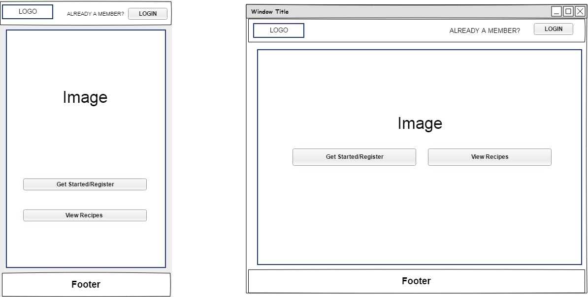
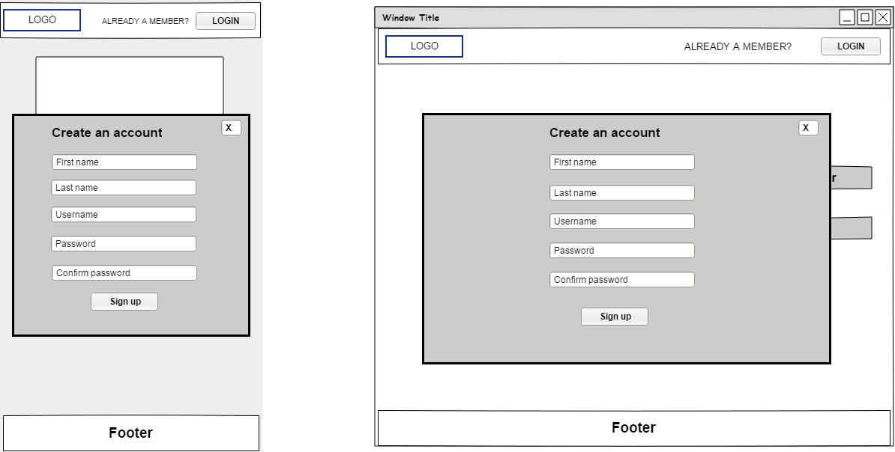
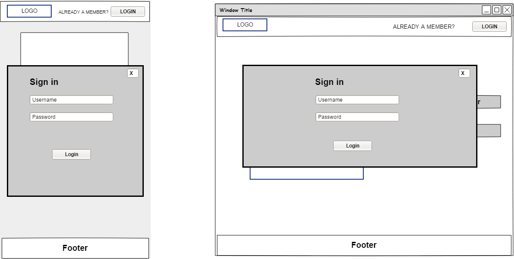
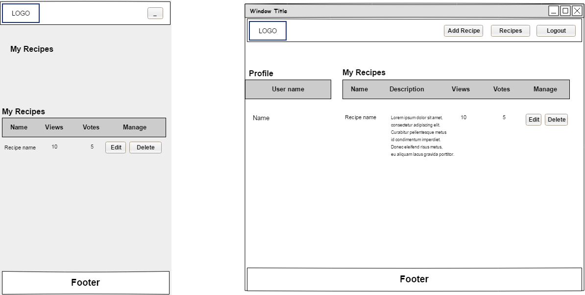
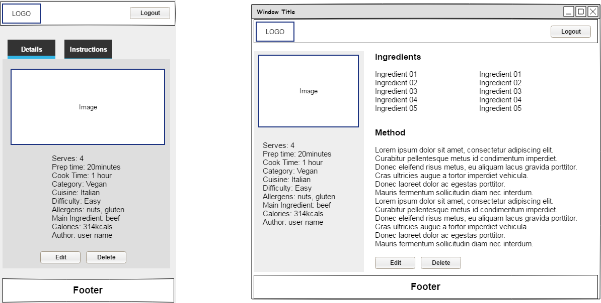
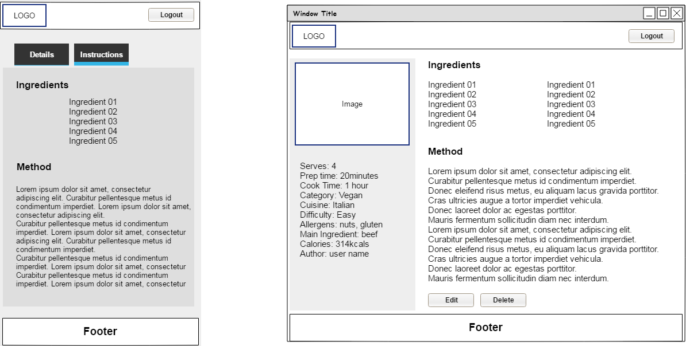
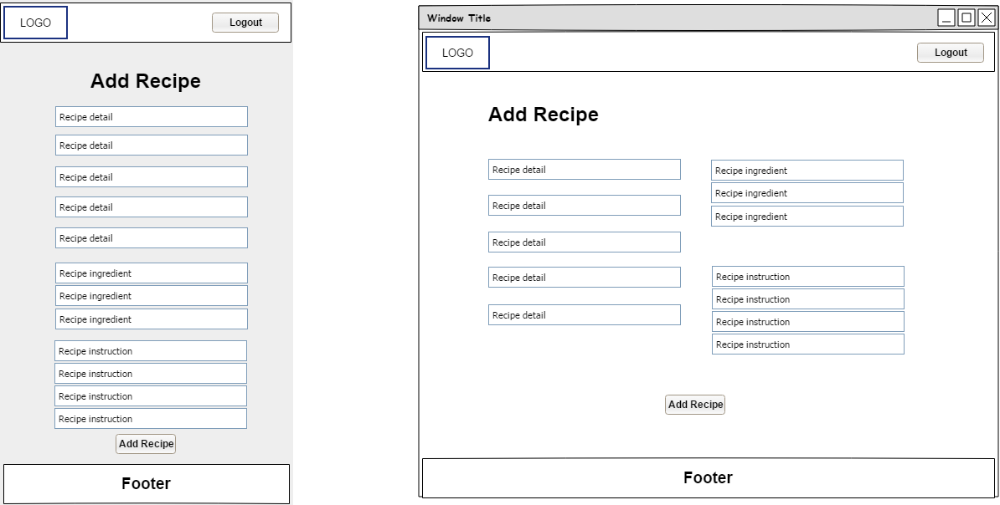
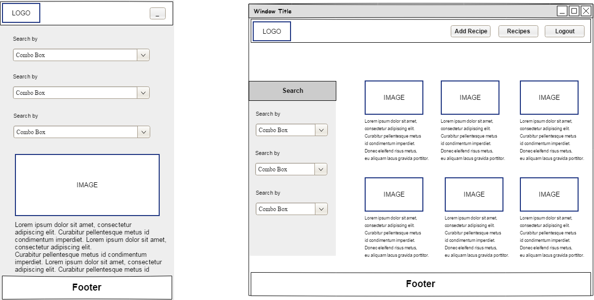
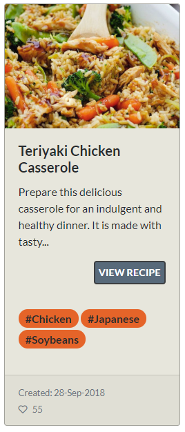

# The Cookbook Online recipe application

Heroku App: https://data-centric-cookbook.herokuapp.com<br>
Heroku git: https://git.heroku.com/data-centric-cookbook.git<br>
GitHub: https://github.com/Sonnerz/project04-data-centric-cookbook<br>


## Guidelines and Guideline fulfilment

1.	**Logic must be written in Python. HTML, CSS, and JavaScript can be used to enhance the look and feel of the cookbook.**<br>
CSS, HTML, Python and JavaScript were all employed to deliver the project requirements.
2.	**Whenever possible, strive to use semantic HTML5 elements to structure your HTML code better.**<br>
Semantic HTML5 elements were used throughout.
3.	**The website must be data-driven and can rely on structured data, unstructured data or a mix of structured and unstructured data.**<br>
The website is data-driven and relies on unstructured data
4.	**CRUD operations can be carried out using either SQL (e.g. MySQL/SQLite/Postgres) or NoSQL (e.g. MongoDB).**<br>
CRUD operations are carried out using MongoDB. <br>
5.	**Use Flask, a micro-framework, to run your application. Provide instructions on how to run your project locally in your README.**<br>
Flask is used to run the application.
6.	**Make sure your site is as responsive as possible. You can test this by checking the site on different screen sizes and browsers.**<br>
The site is as responsive as possible and has been user tested and tested using dev tools<br>
7.	**Share details of how you created your database schema in your README. Consider sharing working drafts or finalised versions of your database schema in a 'Database Schema' folder in your repo. Provide a link to this folder in your README.**<br>
A Database Schema folder can be found in my GitHub repo and further information can be found in the database section of this README – [Database Design](#dbdesign).<br>
8.	**We advise that you write down user stories and create wireframes/mockups before embarking on full-blown development.**<br>
[Scenarios](#Scenarios) and [Wireframes](#Wireframes) are included in this README <br>
9.	**The site can also make use of CSS frameworks such as Bootstrap, just make sure you maintain a clear separation between the library code and your code.**<br>
Bootstrap 4 was used and custom css was created using SASS
10.	**Write a README.md file for your project that explains what the project does and the need that it fulfils.**<br>
A README.md has been provided
11.	**It should also describe the functionality of the project, as well as the technologies used.**<br>
The README has been divided up into Strategy, Scope, Structure, Skeleton and Surface
Each section deals with the functionality and technologies being developed/used at the time.
12.	**If some of the work was based on other code, explain what was kept and how it was changed to fit your need.**<br>
There are comments throughout explaining what inspired my code
13.	**A project submitted without a README.md file will FAIL.**<br>
A ReadME has been supplied.
14.	**Use Git & GitHub for version control. Each new piece of functionality should be in a separate commit.**<br>
Git was used for version control and used regularly throughout development.
15.	**Deploy the final version of your code to a hosting platform such as Heroku.**<br>
The app has been deployed to Heroku and GitHub


##  Non-requirements for this project:

1.	**Secure user authentication (e.g. via passwords) is not required for this particular project. Having each user just choose a username is sufficient. Secure authentication will be introduced in the Django module.**<br>
Users do have to enter a password to register and login in. Werkzeug security was used to encrypt passwords.

2.	**PLAGIARISM**
**It is each student’s responsibility to ensure that when they include (directly or indirectly) the work of others that this contribution is fully and adequately acknowledged and documented.**<br>
Any images used have been credited and any code is credited to it's source - StackOverflow, Pretty Printed, etc.

3.	**You are encouraged to ask your mentor/tutor for advice about your project work, but note that your project code should not include any code written by others unless it is explicitly credited to them with a comment above. Any such code provided by your mentor/tutor would not contribute to your assessment. Failure to attribute credit to code that isn’t yours will be considered as plagiarism and will result in a failing grade.**
My mentor was asked for his advice with regard to the project meeting its requirements. He did not however contribute any code.


<hr><hr>
<a id="top"></a>

# Table of Contents

*   [Preface](#preface)
*   [Strategy Plane](#strategy)
    *   [Define roles and responsibilities](#randr)
    *   [Project Charter](#charter)
    *   [Website development Roadmap](#roadmap)
    *   [Strategy Trade-off](#trade)
    *   [Defensive Design](#def)
*   [Scope Plane](#scope)
    *   [Scenarios/User stories](#scenarios)
    *   [Functional Specifications](#func)
        *   [Functional Flow](#funcflow)
        *   [Future updates](#future)
    *   [Content Requirements](#content)
*   [Structure & Skeleton Plane](#sands)
    *   [Information architecture](#architecture)
    *   [Database design](#dbdesign)
        *   Database design Version 1
        *   Database design Version 2
        *   Database design Version 3
        *   Database collections example
    *   [Wireframes](#wireframes)
        *   Home Page
        *   Register Page
        *   Login Page
        *   My recipes
        *   View Recipe
        *   Add Recipe
        *   Search Recipes
*   [Surface Plane](#surface)
    *   [Development Phase](#dev)
        *   [IDE Setup](#ide)
            *   vscode
            *   MongoDB
            *   Other installations and setup
            *   Git
            *   Bootstrap
        *   [Version Control](#version)
        *   [Development & Testing Tools](#devtest)
            *   Database
            *   Database Content
        *   [Python function explanation](#html)
            *   Navbar
            *   Footer
            *   Home Page
            *   Sign up
            *   Login
            *   My Recipes
            *   Add Recipe page
            *   Edit Recipe page
            *   Delete Recipe
            *   View Recipe page
            *   Recipesearch page
        *   [SCSS/CSS](#scss)
        *   [Config file](#config)
        *   [Current Unresolved Bugs](#bugs)
        *   [Testing documentation](Testing.md)
        *   [Deployment](#deployment)
*  [Credit](#external)


<a id="preface"></a>

# Preface
I made three decisions on this project which affected how I created this application.
The first was my decision to create the app on my local machine rather than cloud9.
I spend a substantial amount of time at the beginning setting up my environment and it was a steep learning curve.
I chose to use vscode and the setup process is documented in the Development part of this README.

The second decision was the choice to use JavaScript as the data carrier between the front-end and the back-end. I hadn’t much experience using JavaScript and specifically ajax. So as a result, quite a large part of data manipulation and data transfer between front and back end is done with Ajax.

The third decision was my choice of database. While I think that SQL may have been a more appropriate database choice for this project, I opted for MongoDB.
I had a small amount of exposure to SQL before this course, but absolutely no exposure or knowledge of noSQL databases. As a result, by choosing the noSQL option it gave me the opportunity to delve into the subject and learn more about the technology.
I began the project using a database on mLab, but as the project progressed I decided to install MongoDB locally and use MongoDB Compass Community and MongoShell. 
This meant I could configure my application for a local database and a production database on mLab. My access details; password and username could be kept confidential as I could use environment variables on Heroku for database access.
There have been database username and passwords pushed to GitHub as a consequence of these early decisions, but this situation has been rectified since the use of Heroku environmental variables.

The statistical analysis of the project was done with Matplotlib and Pandas. There is a link on the main navigation to the site stats. I chose to put it there rather than bury a link in the README.


<a id="strategy"></a>

# Strategy Plane
The overall aim of the project is to create a web application that allows users to store and easily access cooking recipes. The logic of the app will be written using a variety of technologies but predominantly using the Python Flask micro framework, jQuery and MongoDB.  HTML, CSS, and JavaScript will be used to enhance the look and feel of the application. 


<a id="randr"></a>

## Define roles and responsibilities
For the purposes of this project, Sonya Cooley has full authority, primary responsibility, and full accountability for all aspects of the project. 
Sonya has a Mentor available to her throughout the development of the application.


[Top of page](#top)
<a id="charter"></a>

## Project Charter 
||Objectives |
|:---|:---|
|**Purpose:** What purpose does the website serve?|The web application allows users to store and easily access cooking recipes|
|**Goals:** What outcomes does it need to achieve?|<ul><li>allow users to store and easily access cooking recipes </li><li>editing and </li><li>deleting of recipes</li><li>group and summarise the recipes</li></ul>
|**Target audience:** Whom must the product appeal to and work for?|<ul><li>Casual cooks just browsing for an easy recipe </li><li>Cooking hobbyists</li><li>Professional and semi-professional cooks</li></ul>|
|**Success indicators:** How will you know you have achieved project goals?|A steady increase in the number of recipes added by users would be a clear indication of the success of the application|
|**Strategies:** What approaches will help to realise the goals?|<ul><li>We will take a mobile first approach to Content</li><li>Provide useful, interesting and focused content for our target audience</li><li>Aim to keep the site simple and not over complicated</li><li>Present content in a clear and user-friendly way</li></ul>
|**Tactics:** What activities might help to realise the strategies?|<ul><li>Provide useful and relevant content to users</li><li>Provide a user experience that is accessible and enjoyable for all visitors</li><ul><li>following conventions for design and interaction</li><li>providing clear and consistent navigation</li><li>testing usability with a wide range of clients and industry standard tools</li></ul></ul>

[Top of page](#top)
<a id="roadmap"></a>

### Website development Roadmap
The UXD will be driven by the API data and user needs.
|**Define**|Requirements gathering, SEO, Research Competitors,  Content Strategy – Personas, Interesting Content.|
|:---|:---|
|**Design**|Information architecture, Functional & technical requirements, Navigation design, Wireframes, UX/UI, Pages, Branding, style guides, mock-ups.|
|**Develop**|Look & feel, Design and Development, Build, Version control, Testing, Deploy, Read Me|

[Top of page](#top) 

<a id="trade"></a>

### Strategy Trade-off
|Opportunity/Problem|Importance|Viability/Feasibility|
|:---|:---|:---|
|Interesting and fun GUI|5|5|
|Usable GUI|5|5|
|Leader board|5|4|
|Clever use of technology|4|3|


[Top of page](#top)
<a id="def"></a>

## Defensive Design
Defensive design for our Cookbook application will focus on the most common points of failure: user input areas, feedback and server problems.
*	I will employ form validation to check for user mistakes before they frustrate the user
*	I will protect users from server errors and broken links with informative messages
*	My Defensive design will assist the user before mistakes happen.

If users are unsuccessful with any input field, they will be informed by on screen messages that will give clear instructions on how to resolve the issue.
The ‘Create an account’ form will ask users to enter a username to appear on the application, informing them that they have a site account. They will be informed if that username has already been taken and asked to enter a different username. The form will have validation and offer clear instructions to users on how to proceed.

The input area will be protected against malicious code.
A pattern will be added to the input form controls to only allow the input of letters and numbers, no special characters will be allowed: e.g. pattern="[A-Za-z0-9]{1,50}"

This same defensive design will be used throughout the site for every form; add recipe, edit recipe, etc.

Passwords will be encrypted using Werkzeug security, so, in the event that the database is compromised users’ passwords are protected. For this project I did not gather users email addresses or any other unnecessary details.

Environmental variables have been used to protect access details to the database.
Development was done using a local database, and the Heroku hosted app connects to an mLab database. Heroku environmental variables hide the database name, the username and password.


[Top of page](#top)
<a id="scope"></a>

# Scope Plane
The project scope is based on our defined Strategy.
Scoping will;
*	fully define the web application requirements 
*	determine the key functionalities
*	determine what features are to be included in this and possible future application releases

The Cookbook application will target cooking enthusiasts and attract casual site visitors. The site will provide recipes for users to view. A combination of images, and HTML5 will be used to make the interface useful and interesting. Semantic HTML will be used throughout and the site will be responsive to a broad range of devices.  Registered users will be able to add/edit/delete their own recipes.
Site content will be stored in a Mongo database and users can edit or delete only their own recipes.
Python, Flask micro-framework, JavaScript and Mongodb will be the primary technologies used to implement the web application functionality.


[Top of page](#top)

<a id="scenarios"></a>

## Scenarios/User stories

### Cooking Professional/semi-professional::
A cooking enthusiast will be a user who is interested in cooking and baking as a serious hobby or as a profession. 
They will expect specific content for example, lists of ingredients, cooking methods, and allergens.
They will expect to be able to browse recipes or search for specific content. They will also expect content to be grouped into categories, e.g. cuisine. They will want content presented in a logical order, that will be easy to follow. They will register to be able to add/edit their recipes and share what they do.

### Cooking hobbyist:
A hobbyist will visit the site to investigate a possible new recipe source. They will register to be able to add, edit their own recipes and rate others recipes. They will be interested in interacting with the application. They too will want content presented in a logical order, that will be easy to follow.

### Casual cooks:
A casual user will visit the site out of curiosity. They may browse a few recipes, search for some recipes based on a specific ingredient they might be using at the time. They may not register on the site to be able to add/edit recipes. The may visit the recipes page and casually browse the content.
  

[Top of page](#top)

<a id="func"></a>

## Functional Specifications

The site will provide all users with access to cooking recipes and the ability to search/filter recipes by; ingredient, category, cuisine or allergen.

The site will provide registered users the ability to;
*	create an account with a username and password
*	register a username and be identified by that username
*	browse recipes
*	filter/search recipes by category, cuisine, and ingredient
*	search for recipes without an allergen
*	add their recipes
*	edit their recipes
*	delete their recipes
*	view recipe details – ingredients and cooking instructions, allergens, etc
*	rate/like recipes

The cooking application will be optimised for latest version of Chrome, Firefox, Internet Explorer, Safari and Opera and optimised for mobile usage. HTML and CSS will be written using the Mobile-First approach. The mobile-first approach is designing for the smallest screen and working your way up to desktop.

<a id="funcflow"></a>

### Functional Flow
All users will access the site via /index. They can visit the recipe search page from here, login or register. Users can register for the site or if already registered can log in.
Login is available at all times to users as it is in the navbar. It changes to Logout if a user is logged in. The login dialog box also has a link to the registration/signup form.
If unregistered users attempt to access; myrecipes, addrecipe or editrecipe they will be redirected to the index page and informed that they need to be logged in to see those pages.
Unregistered users only have the option to go to recipesearch page. Registered users will be taken to myrecipes page after they log in. From there they can manage their recipes or add new ones.


<a id="future"></a>

### Future Updates

*	Ability for registered users to tag favourite recipes and store in a favourites list
*	Ability for registered users to share a recipe on social media
*	Ability for registered users to write recipe reviews on other users’ recipes
*	Pagination on the recipe search results page


[Top of page](#top)
<a id="content"></a>

##    Content Requirements
The Cooking application will follow a standard format, with a HTML5 structure based on Bootstrap 4. 
The application will have a fixed to top navbar always available to users and a footer containing links to further information.


**PAGE :: Home page (/)**

The home page will present users with a welcoming image and the option to view recipes, log in and register.

**MODAL :: Registration**

The registration form will ask users for; 
*	a username
*   their first name
*   their last name
*   a password
*   password confirmation


**MODAL :: Log in**

The login form will ask users for; 
*   their previously registered username
*   password


**PAGE :: Search Recipes (/recipesearch)**

The search recipes page will allow users to; 
*	search by ingredient
*   search by category
*   search by cuisine
*   search for recipes without an allergen
*   search for a combination of category and cuisine


**PAGE :: Add/edit recipe (/add_recipe, /edit_recipe)**

The form for adding/editing a recipe will provide registered users with the following fields; 
*	Recipe name
*   Link to recipe image
*   Recipe description
*   Main ingredient
*   Category
*   Cuisine
*   Difficulty
*   Allergens
*   Prep time
*   Cook time
*   Calorific information
*   Servings
*   Ingredients
*   Instructions

dateCreated, dateModified and votes fields will be auto added to the recipe database document when a recipe is added.
dataModified will be updated when a recipe is edited.
votes will be updated when a user votes for that recipe.

**PAGE :: My recipes (/myrecipes)**

A content page where registered user’s recipe details are presented in a clear and intuitive layout.
Registered users can manage their recipes; view, edit or delete.


**MODAL :: Delete a recipe**

The option to delete a recipe will present a challenge to the user to ensure that they do wish to delete that specific recipe. The challenge will be in the form of a popup modal with a delete or cancel button.


**PAGE :: View Recipe (/view_recipe/<recipe_id>**

A content page where all users can view the recipe details.
Registered users will see an edit recipe button and a delete recipe button if they own that recipe.
They will also be able to rate/like the recipe if they do not own the recipe.
Users will be able to vote only once per recipe.

All html pages will be created using HTML5 and CSS3, supported by the Bootstrap 4.0 Framework.
All recipe data will be stored in a noSQL Mongo database.


**Navigation**

Please note, there is a link to site stats on the navbar. This would normally not be made available to users, however for this project it is there for assessors.
The navbar will be available to users at the top of the application on every page.
Unregistered users will see links to Login and Recipes
Registered users will see links to Login, Recipes, Add Recipe and My Recipes


[Top of page](#top)

<a id="sands"></a>

#  Structure & Skeleton Plane

Our goal for the Structure plane is to organise the information architecture and interactions for the application. We will keep a consistent, predictable, and learnable interface that users should be familiar with if they regularly use the internet. We will use industry standard technologies to implement expected behaviours when using the application, e.g. tooltips, navigation, including accessibility, etc.
Users will find navigation and user information at the top of the application. 
The input fields will follow user expectations where feedback is provided if user interactions are unexpected, correct or incorrect.


<a id="architecture"></a>
## Information architecture
The application directories and files will be organised in the following way;


|<ul><li>Site Root</li><ul><li>Directory: Database Schema</li><li>Directory: jupyter notebooks</li><li>Directory: scss</li><li>Directory: static</li><li>Directory: stats</li><li>Directory: templates</li><li>.gitignore</li><li>Procfile</li><li>requirements.txt</li><li>ReadMe.md</li><li>app.py</li></ul></ul>|<ul><li>Database Schema</li><ul><li>database schema images</li></ul></ul><ul><li>jupyter notebooks</li><ul><li>all jupyter notebooks</li></ul></ul><ul><li>scss Directory</li><ul><li>all scss files</li></ul></ul><ul><li>static Directory</li><ul><li>css sub-directory</li><li>css sub-directory</li><li>data sub-directory</li><li>img sub-directory</li><li>js sub-directory</li></ul></ul><ul><li>stats</li><ul><li>statistics.py</li></ul></ul><ul><li>templates Directory</li><ul><li>404.html</li><li>500.html</li><li>addrecipe.html</li><li>base.html</li><li>editrecipe.html</li><li>graphs.html</li><li>index.html</li><li>myrecipes.html</li><li>recipesearch.html</li><li>resultTemplate.html</li><li>viewrecipe.html</li></ul></ul>|
|:---|:---|


[Top of page](#top)

<a id="dbdesign"></a>

##  Database design

###   Database design Version 1

Version 1 had everything in one collection – user and recipe info.
Based on the fact I was using a noSQL database I thought the best approach was one object and no foreign key relationships.
I would return the user info and recipe with every call to the database.


### Database design Version 2

Following database version 1, I began with sign up and login forms.
I was adding users to the recipes collection and not considering the access to recipes.
When I began the recipe display part of the project I realised how difficult it was to search for recipes as they were part of a collection where the user was the main entity.
It was proving difficult to access one recipe object inside a user/recipe object and it would prove difficult to search for specific recipes

After a conversation with fellow students and reading;

https://docs.mongodb.com/manual/tutorial/model-referenced-one-to-many-relationships-between-documents/
https://docs.mongodb.com/manual/reference/database-references/

I decided to redesign my mongo database.
I opted to keep collections; categories, cuisine, difficulty, allergens to populate my dropdown lists.
I separated my users from the recipes to create two separate entities.
As a recipe document is created in the recipes collection, the author of the recipe (the user who was logged in) is recorded against the recipe under the author field(STR).
The author field becomes a Foreign Key in the recipe document to the primary key User _id in the user’s document in the Users collection.

The recipe document fields design was driven predominantly by the Add Recipe form.
Votes and views were added to record the number of votes and views for that recipe
When the recipe document is created both votes and views are set to 0.


### Database design Version 3

As development continued further updates were made to the users and recipes collections.
Either to add or remove functionality.
I added hashed_password and recipe_votes to the user’s collection.
-	hashed_password stores a STRING of encrypted password. I added password encryption to the sign_up function
-	recipe_votes is an array storing the recipes the user has voted for on the iew recipes page.

I added dateCreated and dateModified to the recipes collection.
-	dateCreated is a DATE field storing the date the recipe was added
-	dateModifed is a DATE field storing the date the recipe was modified
-	I updated the votes field to an integer type so that it can be easily updated as a user votes up a recipe
-	I removed the views field. I decided not to implement this functionality

I created a text index to include: name, description, category, cuisine, main_ingredient, ingredients ,& allergens. This index is used for when users click the #hashtag links on each recipe summary in the search results page.


### Database collections example
**Sample Recipe doc**

```
"author": "5ba6a175d4cff52894ef222c",
"name": "Macaroni cheese with leeks",
"image_url": "https://ichef.bbci.co.uk/food/ic/food_16x9_448/recipes/toad_in_the_hole_with_86283_16x9.jpg",
"description": "This easy four-step recipe for macaroni cheese will please all the family. Get a little extra vegetable into your mac and cheese with sweet leeks tucked in the cheese sauce and peas alongside.",
"main_ingredient": "Macaroni",
"category": "Pasta",
"cuisine": "Italian",
"difficulty": "Easy",
"prep_time": "less than 30 mins",
"cook_time": "30 mins",
"serves": 4,
"calories": "350kcal",
"allergens": 
[
        "gluten",
        "eggs",
        "milk",
        "sulphites"
    ],
"ingredients": 
[
        "300g/10½oz dried macaroni",
        "2 leeks",
        "45g/1½oz butter",
        "45g/1½oz flour",
        "600ml/1 pint milk",
        "1 tsp mustard",
        "dash Worcestershire sauce",
        "200g/7oz cheddar, grated",
        "60g/2¼oz breadcrumbs",
        "250g/9oz frozen peas, to serve",
        "salt and freshly ground black pepper"
    ],
"instructions": 
[
"Preheat the oven to 200C/180C Fan/Gas 6. Bring a large pan of salted water to the boil and add the macaroni. Cook for 5 minutes then drain.",

"Meanwhile trim the leeks, discarding the green parts, then thinly slice. Melt the butter in a large saucepan, add the leeks and cook gently for 5 minutes, or until soft. Add the flour and cook for 2 minutes, stirring constantly. Add the milk little by little, stirring constantly, then cook gently for 5 minutes, stirring all the time until the sauce is thickened. Add the mustard and Worcestershire sauce then remove from the heat. Stir in the grated cheese and season with salt and pepper.",

“Add the pasta to the sauce, stir to combine then pour into a 2 litre/3½ pint ovenproof dish. Sprinkle over the breadcrumbs and bake for 25 minutes until golden-brown.",

"Towards the end of cooking, bring a pot of water to the boil. Add the peas, cook for 3-4 minutes then drain. Serve the macaroni cheese with the peas."
],
"votes": 156,
“dateCreated”: 2018-09-25 16:08:45.694
“dateModified”: 2018-09-25 16:08:45.694
```

**Sample User doc**
```
“_id”: 5ba6a0cfd4cff52894ef222a
“username”: "admin"
“Firstname”: "Joe"
“lastname”: "Bloggs"
“hashed_password”: "sha256$d9uQWVAk$f2b4bddfc8d858ed7842d8c93813b426036da4451c7a5419f8688e..."
“recipe_votes”: 
[
     5ba6a0cfd4cff52894efefkv,
     5ba6a0cfd4cff52894ejijnie
]
```

[Top of page](#top)
<a id="wireframes"></a>
##  Wireframes

## Home Page (‘/’ index.html)<a id="homewf"></a>


## Register Page (‘/sign_up   signup.html)<a id="signwf"></a>


## Login (‘/login login.html)<a id="lloginwf"></a>


## myrecipes (‘/myrecipes myrecipes.html)<a id="mywf"></a>


## Recipe (‘/recipe   recipe.html)<a id="recipewf"></a>




## Add Recipe (/add_recipe add_recipe.html) <a id="addwf"></a>



## Search Recipes (/recipesearch  recipesearch.html) <a id="addwf"></a>



[Top of page](#top)
<a id="surface"></a>
#  Surface Plane

<a id="dev"></a>
## Development Phase

<a id="ide"></a>

### IDE - SETUP - VSCODE

1.	After opening vscode I created a workspace
2.	Create ‘venv’ directory for virtual environment. Bash terminal: py -3 -m venv venv
3.	Open the project folder
4.	View – Command Palette
5.	Python: Select Interpreter
6.	Python: Create Terminal
7.	Install flask in that virtual env:  pip3 install flask
8.	Upgrade pip: python -m pip install --upgrade pip
9.	Debug - Open Configurations-Python
```
{
            "name": "Python: Flask (development mode)",
            "type": "python",
            "request": "launch",
            "module": "flask",
            "env": {
                "FLASK_APP": "app.py",
                "FLASK_ENV": "development"
            },
            "args": [
                "run"
            ]
}
```
10. For testing see [Testing documentation](Testing.md)


### IDE - SETUP - MongoDB

1.	mLab: Create new database – cookbook
2.	Later in the project during development, I created a local mongodb database
3.	To connect using the mongo shell:
`mongo ds251332.mlab.com:51332/cookbook -u <dbuser> -p <dbpassword>
mongodb://localhost:27017/cookbook`
4.	To connect using a driver via the standard MongoDB URI
`mongodb://<dbuser>:<dbpassword>@ds251332.mlab.com:51332/cookbook`
5.	pip3 install flask_pymongo


### IDE - SETUP - Other installations and setup

*   **iPython**:	pip3 install ipython
*   **jupyter***:	pip3 install jupyter
*   **matplotlib**:	pip3 install matplotlib
*   **pandas**:	pip3 install pandas
*   **PyLint install**:	pip install -U pylint

*   **Run jupyter**:	jupyter notebook --ip=0.0.0.0 --port=8080 --no-browser
*   **Create requirements.txt**:	pip3 freeze --local > requirements.txt
*   **Create Procfile**:	echo web: python app.py > Procfile


### IDE - SETUP - Git

1.	Git init
2.	Create .gitignore: Touch .gitignore and the following files and directories were added;
    *   a.	venv/*
    *   b.	.vscode/*
    *   c.	*.pyc
    *   d.	__pycache__/
    *   e.	instance/
    *   f.	.webassets-cache
    *   g.	profile_default/
    *   h.	ipython_config.py
    *   i.	*.ipynb
    *   j.	cookbook_workspace.code-workspace
    *   k.	connection_details.py
3.	Git add.
4.	Git commit – m “Initial Commit”


### IDE - SETUP - Bootstrap

1.	$ wget https://stackpath.bootstrapcdn.com/bootstrap/4.1.3/css/bootstrap.min.css
2.	$ wget https://stackpath.bootstrapcdn.com/bootstrap/4.1.3/js/bootstrap.min.js
3.	$ wget https://cdnjs.cloudflare.com/ajax/libs/popper.js/1.11.0/umd/popper.min.js


[Top of page](#top)

<a id="version"></a>
### Version Control

Git was used to manage the source code for this project. Git is a version control system for tracking changes in project files.
Project files were committed to Git after each major functional addition, update or implementation of testing results.
Following the initial commit to Git, each major update was followed by a Git add and commit. 
**A full Git log is available on the GitHub project repository**.


[Top of page](#top)

<a id="devtest"></a>
### Development & testing tools

During development jupyter notebooks were used primarily to test most functions before adding them to app.py, especially the database query functions. The jupyter files are available in my github repository under the jupyter_notebooks directory.

[Jupyter Notebooks](/jupyter_notebooks)

HTML and some JavaScript functionality were tested using repl.it

At all times python code, html or css updates were tested in the browser. Chrome dev tools console was used to examine and test JavaScript output. Every response was written to the console for testing.
Vscode terminal was used to examine and test python code. The print() and in particular print(type()) function was used extensively to examine code values.


[Top of page](#top)

<a id="devtest"></a>
### Database

|Text index||
|:--|:--|
|I added a text index to the database for users to search by #hashtags `db.recipes.createIndex({name: 'text', description: 'text', category: 'text', cuisine: 'text', main_ingredient: 'text', ingredients: 'text', allergens: 'text'})`||


**Database content**

https://www.themealdb.com/ provides an api to access recipes on the internet.
I created a html file to connect to the api and get random recipes for my recipe collection.
The HTML file is in Database schema folder. (getrecipes.html)

It outputs a json file of randomly selected recipes. I have hardcoded some db field values as they were missing from the source data.
It was a quick and easy way to get some content into an empty database for development purposes.


[Top of page](#top)

<a id="html"></a>

### Python function explanation

**Navbar**

The navbar is fixed to top. A site logo on the left side while navigation elements are right aligned.
The navigation elements are different depending on whether a user is logged in or not.
|Not logged in|Logged in|
|:--|:--|
|Site Stats|Sites Stats|
Recipes|Recipes|
|Login|My Recipes|
||Add Recipe|
||Logout|


**Footer**

The footer contains general information but in particular it has the licensing info for the icons I used on the site.


**Home Page**
-	@app.route('/')
-	Index()

The web application home page gives the user the option of; registering/signing up to the site or if already signed up, the option to Log in. A navbar and footer will bookend the content area.
The page and its functionality will be created using the Bootstrap 4 Framework, Python, Flask micro-framework and JavaScript.


**Sign up**

-	/signup_user
-	signup_user() – gets data from ajax POST

Sign up dialog box is a popup window, provided by using a Bootstrap 4 Modal.
The user can register on the site or can click a close button or an x button to clear the modal.

**Login**

-	/login_user
-	login_user() – gets data from ajax POST
-	compare_password()

Log in dialog box is a popup window, provided by using a Bootstrap 4 Modal.
The user logs in to the site or can click a close button or an x button to clear the modal.


**My Recipes**

-	/myrecipes
-	login_required() – ensures a user is logged in before they can view the page
-	myrecipes()

The myrecipes page presents users with details about their recipes and the ability to manage the recipes. The page lists their recipes and provides information e.g. created date, votes on each recipe. The user can edit or delete their recipes from this page.
Pagination functionality has been added to this function. It makes a db call to get recipes belonging to that user and pages the results using offset and limit values passed in the url.
The page and its functionality were created using the Bootstrap 4 Framework, JavaScript, Python and The Flask micro-framework.

**Add Recipe page**

-	/add_recipe
-	login_required()
-	add_recipe()
-	insert_recipe() – gets data from ajax POST
-	get_categories() – populates the categories dropdown lists
-	get_cuisine() – populates the cuisine dropdown lists
-	get_allergens() – populates the allergens checkboxes
-	get_difficulty() – populates the difficulty dropdown lists

This page presents users with a form to add a new recipe to the site. The data is passed from the form to python via Ajax.
The page and its functionality were created using the Bootstrap 4 Framework, JavaScript, Python and The Flask micro-framework.


**Edit Recipe page**

-	/edit_recipe/<recipe_id>
-	login_required()
-	get_categories() – populates the categories dropdown lists
-	get_cuisine() – populates the cuisine dropdown lists
-	get_allergens() – populates the allergens checkboxes
-	get_difficulty() – populates the difficulty dropdown lists
-	edit_recipe()
-	/update_recipe/<recipe_id>
-	update_recipe() – gets recipe id from url posted by Ajax

This page presents all the recipe details to its owner. The owner can update any recipe details and resubmit the recipe. The data is passed from the form to python via Ajax. The page and its functionality were created using the Bootstrap 4 Framework, JavaScript, Python and The Flask micro-framework.


**Delete Recipe**

-	login_required()
-	delete_recipe() – gets recipe id posted by Ajax

There are two locations where the owner can delete their recipe. A delete button is available on the myrecipes page and if a user is viewing a recipe and is the owner of that recipe they will be presented with an edit button and delete button.
The page and its functionality were created using the Bootstrap 4 Framework, JavaScript, Python and The Flask micro-framework.


**View Recipe page**

-	view_recipe/<recipe_id> 
-	view_recipe() – gets recipe id posted in the url by Ajax
-	update_vote() – gets recipe id posted in the url by Ajax

the update_votes() function adds a vote to the recipe. It is only available to logged in users.
This page presents all the recipe details to a user; ingredients, instructions, calorific info, prep time, cooking time, allergens, an image, etc.
The page and its functionality were created using the Bootstrap 4 Framework, JavaScript, Python and The Flask micro-framework.


**Recipesearch page**

This page presents recipes to a user depending on which filter option a user chooses.
When the page loads, the following recipe summaries are presented:
-	the 3 most recent recipes - get_recent_recipes()
-	the 3 highest rated recipes - get_votes_recipes()
-	a random selection of 9 recipes - get_random_recipes()

This content disappears and is replaced by search results after a user makes a search query
-	recipesearchquery() – finds recipes by searching description, category, cuisine or ingredients for the word. The #hashtag word that appears in the recipe summary.
-	filter_by_category () - finds recipes by searching category. It gets the category posted in the url by Ajax
-	filter_by_cuisine() - finds recipes by searching cuisine. It gets the cuisine posted in the url by Ajax
-	filter_by_allergen() - finds recipes by searching allergens. It gets the allergen posted in the url by Ajax
-	filter_by_ingredient() - finds recipes by searching ingredients. It gets the ingredient posted in the url by Ajax
-	filter_by_catcuis() - finds recipes by searching and matching category and cuisine. It gets the category and cuisine posted in the url by Ajax

The page and its functionality were created using the Bootstrap 4 Framework, JavaScript, Python and The Flask micro-framework.


[Top of page](#top)

<a id="scss"></a>

**SCSS/CSS**

Bootstrap 4 provides the fundamental HTML5, CSS and JavaScript for the application to ensure that it meets the Responsive requirement.
However, custom styles have been created and a styles.css file can be found in the static/css directory.
Custom styles for each page, and bootstrap overrides are in their own SCSS file.

<ul>
<li>addeditrecipe.scss </li><li>
bootstrap-overrides.scss</li><li>
footer.scss</li><li>
global.scss</li><li>
index.scss</li><li>
mixins.scss</li><li>
myrecipes.scss</li><li>
navbar.scss</li><li>
recipe.scss</li><li>
recipesearch.scss</li><li>
variables.scss</li><li>
styles.scss</li>
</ul>

[Top of page](#top)
<a id="config"></a>

##  Config file

At the start of the project I was using config file to store my database user name and password.
However, this was the wrong approach as the config file needs to be added to git and pushed to a server for access. It also meant the access details would end up on publicly accessible on GitHub.
I then changed the app to use environmental variables.
*   app.py file has been created for the app code
*   stats/statistics.py contains functions to create site statistics

<a id="bugs"></a>

##  Current Unresolved Bugs

*   If a user is editing a recipe they can enter the id of a recipe they do not own into the url and edit that recipe. A check needs to be done to ensure ownership of the recipe before an update is committed.

*   The pagination on the My Recipes page is not very robust and not suitable for large amounts of data. This functionality will have to be redesigned for future versions of the application.

[Top of page](#top)


<a id="deployment"></a>

### Deployment

GitHub is used to host the code and Heroku was used to host the app.

**GitHub**

1   A new repository was created in GitHub called: `project04-data-centric-cookbook`
After a final Git Add and Git commit

1.  `git add.`
2.  `$git commit -m "Final commit"`
The pages were pushed to the new GitHub repository
5.  `$ git remote add origin https://github.com/Sonnerz/project04-data-centric-cookbook`
6.  `$ git push -u origin master`
7.  `Enter: _username_`
8.  `Enter: _password_`

Heroku is used to host the code and publish the app publicly.

I logged into Heroku and created a new app called **data-centric-cookbook**<br>
I chose the European hosting region<br>
A git repo was created: https://git.heroku.com/data-centric-cookbook.git<br>
A heroku app url was provided: https://data-centric-cookbook.herokuapp.com<br>

In Heroku under the app settings I added the following config vars:
*   IP - 0.0.0.0
*   PORT – 5000
*   MONGODB_URI - mongodb://<username>:<password>@ds251332.mlab.com:51332/cookbook
*   DBS_NAME - cookbook


In a bash terminal, I ran the following commands:
1.  `$ heroku`
2.  `$ heroku login`
3.  Enter: _username_
4.  Enter: _password_
5.  `$ heroku apps` (to confirm my app was there)
6.  `$ git remote -v`
7.  `$ git remote add heroku https://git.heroku.com/data-centric-cookbook.git`
8.  `$ git push -u heroku master`
9.  `$ heroku ps:scale web=1`


[Top of page](#top)

<a id="external"></a>

# Credit

##  Content/ Acknowledgements

The following sites were used as resources to get sample css and debugging css.

|Site|URL|Resource
|:---|:---|:---|
|Stack Overflow| http://stackoverflow.com | Code snippets/idea throughout the project
|w3schools Python| https://www.w3schools.com/python |HTML, CSS, Python
|Startbootstrap| https://startbootstrap.com |Agency template
|daneden.github| https://daneden.github.io/animate.css | Flash messages animation
|The Meal DB| https://www.themealdb.com/api.php | Recipe source
|Slack |Db design advice|
|jqueryui|http://jqueryui.com/dialog/#modal-confirmation | Confirm deletion of recipe modal
|Pretty Printed|https://www.youtube.com/watch?v=Lnt6JqtzM7I| Pagination on my recipes page
|Slack|Code Institute slack|Slack members user tested my application
|Stack Overflow|https://stackoverflow.com/questions/23555978/bootstrap-responsive-layout-in-mobile-convert-to-tabs/31765611| Inspiration for changing recipe layout to tabs in mobile view
|Sentdex|YouTube|Error Handling, 404, 500


##  Media

|Media|Scource||
|:---|:---|:--|
|Home page background image| https://unsplash.com/| Owner credited on home page
|Logo cooking pot | Free Vector Design by: <a target="_blank" href="https://www.vecteezy.com">vecteezy.com</a> |
|Logo|Created in Photoshop|
|Google Fonts|Lato|
|Icons|https://www.flaticon.com/packs/cooking-46| icons used throughout site e.g. heart, apron|
|The Meal DB| https://www.themealdb.com/api.php | Recipe images

[Top of page](#top)


